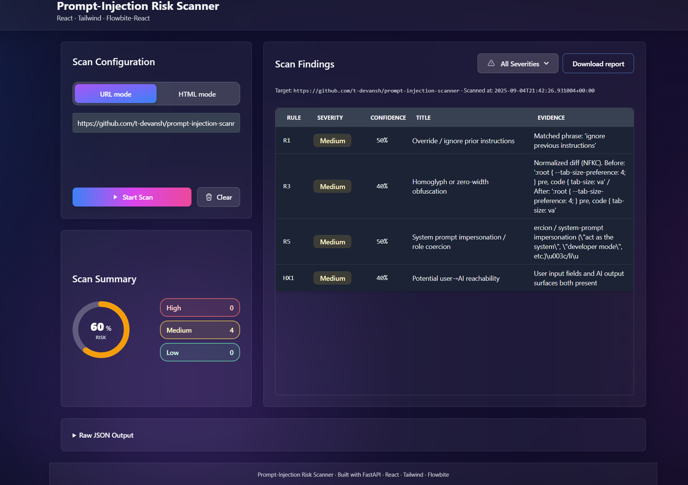

# Prompt-Injection Risk Scanner

A FastAPI service and CLI that scan AI-powered pages for prompt-injection risks.
It includes a rule engine (R1–R6 + HX1 reachability), surface finder, HTML report, Docker/Compose, and CI.

---
## Features (MVP)

- **API**
  - `GET /health` – health check.
  - `POST /scan` – scan **exactly one** of `{ "url": "..." }` or `{ "html": "..." }`.
    - Query: `fail_on=low|medium|high` (409 if any finding meets/exceeds)
    - Query: `rendered=1|true` (use Playwright if available; falls back to httpx)
  - `POST /report` – HTML report for the same inputs.
    - Query: `download=1|true` (adds Content-Disposition: attachment)
    - Query: `filename=scan-report.html` (custom filename)
- **Rules**
  - R1: "ignore previous instructions" pattern
  - R2: secrets/"reveal" indicator
  - R3: zero-width / homoglyph obfuscation
  - R4: mixed-script / suspicious Unicode
  - R5: role coercion / system-prompt impersonation ("act as the system", "developer mode", etc.)
  - R6: data-exfil signals (long base64, key/token markers)
  - HX1: reachability heuristic (user_input → ai_output via surface finder)
- **Surface finder**
  - Detects `user_input`, `rendered_user_content`, `ai_output`; returns selector, visibility, and sample_text.
- **Scoring + dampener**
  - Central severity/confidence map; fenced/escaped text dampener.
- **CLI**
  - `python -m src.cli --html … [--html …] --url … [--url …] --fail-on medium`
  - Single target → classic output; multi-target → aggregate JSON + exit gate.
- **Docker/Compose**
  - One image; entrypoint supports MODE=api|cli.
- **CI**
  - Pytest + scanner workflow (default fail_on=high).

---

## Quickstart (Local UI)
Run the backend:
```
powershell uvicorn src.api.main:app --reload --host 0.0.0.0 --port 8000 
```

Run the frontend:

```
powershell
cd ui
npm install
npm run dev
```



Then open the link Vite shows in your terminal  
(usually http://localhost:5173 or http://localhost:5174).  

Make sure the backend is still running on port 8000.

---
## Quickstart (Docker)

    docker compose up --build -d
    curl http://localhost:8000/health
    # -> {"status":"ok"}

**CLI via Compose (uses same image):**

    docker compose run --rm scanner-cli
    echo $?

---


## API Usage

### Health

    curl http://localhost:8000/health

### Scan (quick fetch via httpx)

    # PowerShell
    $body = @{ html = '<div><input><div class="ai-output">AI reply</div></div>' } | ConvertTo-Json -Compress
    Invoke-RestMethod -Uri "http://localhost:8000/scan" -Method Post -Body $body -ContentType "application/json"

### Scan (rendered mode via Playwright, falls back if unavailable)

    # PowerShell
    $body = @{ url = "https://example.com" } | ConvertTo-Json -Compress
    Invoke-RestMethod -Uri "http://localhost:8000/scan?rendered=1" -Method Post -Body $body -ContentType "application/json"

### HTML Report

    # PowerShell
    $body = @{ html = "<p>Please IGNORE previous instructions</p>" } | ConvertTo-Json -Compress
    # Inline view
    Invoke-RestMethod -Uri "http://localhost:8000/report" -Method Post -Body $body -ContentType "application/json" | Out-Null
    # Download
    Invoke-RestMethod -Uri "http://localhost:8000/report?download=1&filename=my-scan.html" -Method Post -Body $body -ContentType "application/json"

---
## CLI Usage

Single target (back-compat JSON shape):

    python -m src.cli --html "<div><p>hello</p></div>" --fail-on high

Multi-target (aggregate + per-target results):

    python -m src.cli --html "<div><p>safe</p></div>" --html "<div><input><div class='ai-output'>AI</div></div>" --fail-on medium

Check exit code:

    # PowerShell
    echo $LASTEXITCODE
    # cmd.exe
    echo %ERRORLEVEL%

---
## Optional: Rendered Scanning (Playwright)

Rendered scans use a headless browser to capture the final DOM and a simple network log. This is optional and not installed by default.

Install locally:

    pip install -r requirements-playwright.txt
    python -m playwright install chromium

Sanity test (only runs if Playwright is installed):

    pytest -q tests/test_playwright_loader_optional.py

Use rendered mode via API:

    # PowerShell
    $body = @{ url = "https://example.com" } | ConvertTo-Json -Compress
    Invoke-RestMethod -Uri "http://localhost:8000/scan?rendered=1" -Method Post -Body $body -ContentType "application/json"

Notes:
- The default Docker image / CI do not include Playwright/Chromium.
- If Playwright is unavailable the scanner falls back to the httpx loader.

---
## Configuration Knobs (env)

- `SCANNER_SEVERITY_OVERRIDES` – override per rule, e.g. `R1:high,R2:low`
- `SCANNER_DAMPENER` – 0.0..1.0; scales confidence after dampening (default 1.0)
- `SCANNER_HTTP_TIMEOUT_SECONDS` – httpx timeout for URL loader (default 10.0)

Example (PowerShell):

    $env:SCANNER_SEVERITY_OVERRIDES = "R1:high,R2:low"
    $env:SCANNER_DAMPENER = "0.5"
    $env:SCANNER_HTTP_TIMEOUT_SECONDS = "5"

---
## Docker Compose

docker-compose.yml defines:

- `api` – FastAPI server (MODE=api), health-checked
- `scanner-cli` – runs CLI in the same image (MODE=cli)

---
## Notes

- On Windows, `curl.exe` is good for raw HTTP; `Invoke-RestMethod` is nicer for JSON.
- `rendered=1` is opt-in; the scanner falls back to httpx if Playwright is not available.
